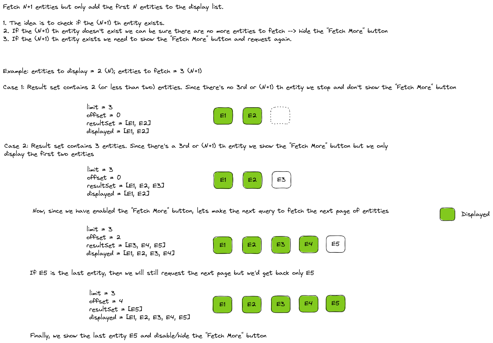

## Getting Started

First, run the development server:

```bash
npm run dev
# or
yarn dev
```

Open [http://localhost:3000](http://localhost:3000) with your browser to see the result.

## Context

Prisma doesn't return meta information like `total_page` or `no_of_pages` when returning [paginated results](https://www.prisma.io/docs/concepts/components/prisma-client/pagination). With information like `total_page` we can know beforehand if we are at the end of the page and show/hide relevant information. In prisma, this doesn't seem to be possible at the moment without [adding a second query](https://github.com/prisma/prisma/discussions/3087#discussioncomment-39983) to fetch the count of results.

## Problem

There's a `Fetch More` button at the bottom of a list. We need to enable this button only if we have more records to show. If not, we should hide this button.

## Solution

This [demo implementation](https://stackblitz.com/edit/nextjs-m8xcgk) doesn't use a second query. While fetching each page it retrieves one more record than the required page size. With this approach, the maximum number of records fetched twice is equal to the number of page requests. A more detailed explanation is attached below.


